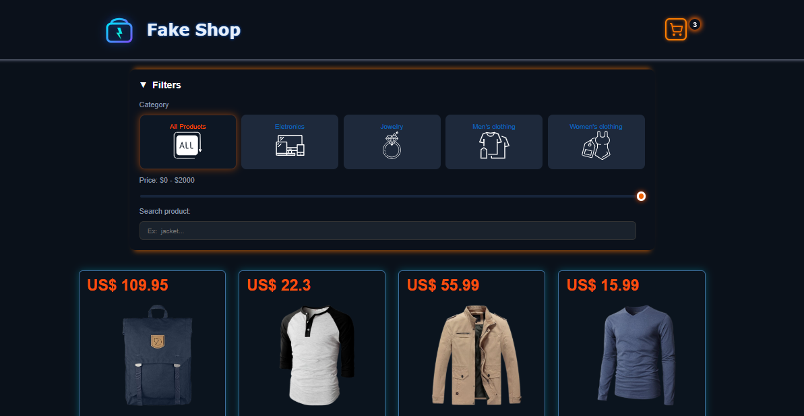
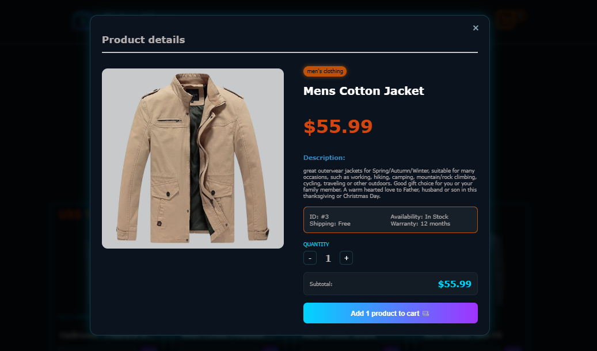
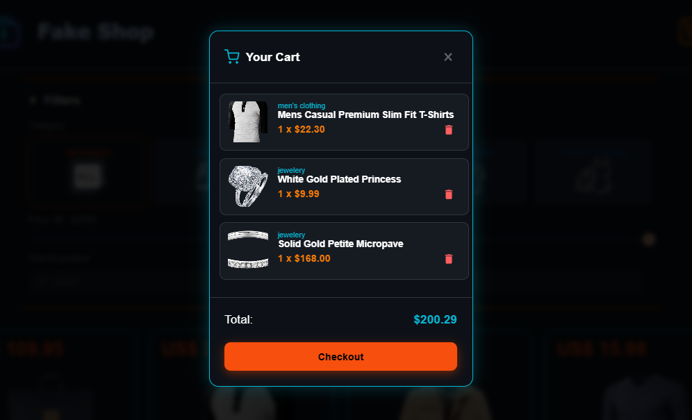

# ⚡ Fake Store - Cyberpunk E-commerce


**Fake Store** es una aplicación de comercio electrónico con una estética futurista **Cyberpunk**. Utiliza la [Fake Store API](https://fakestoreapi.com/) para gestionar productos en tiempo real, ofreciendo una experiencia visual impactante basada en contrastes neón y efectos de cristal (glassmorphism).

---

## 🚀 Funcionalidades Principales

* **🛒 Carrito de Compras Inteligente:** Persistencia de datos mediante `LocalStorage`, cálculo de totales y gestión de cantidades.
* **🔍 Filtros Dinámicos:** * Búsqueda de productos por nombre.
    * Filtrado por categorías dinámicas desde la API.
    * Rango de precios mediante un slider interactivo.
* **📱 Diseño 100% Responsivo:** Adaptado para que el carrito y los detalles del producto se vean perfectos en móviles y laptops.
* **💳 Pasarela de Pago Proyectada:** Botón de finalización de compra con redirección lógica a **PSE**.
* **✨ UI/UX Futurista:** Uso extensivo de `backdrop-filter`, `box-shadow` neón y transiciones suaves.

---

## 🛠️ Stack Tecnológico

* **Frontend:** HTML5, CSS3 (Flexbox & Grid).
* **Lógica:** JavaScript Vanilla (ES6+).
* **API:** Fake Store API (REST).
* **Almacenamiento:** Browser LocalStorage.

---

## 📦 Estructura del Proyecto


```bash
Proyect_javascript/
├── index.html  
├── README.md
├── analisis.md
├── Wireframe/
├── CSS/
│   └── index.css       
└── JavaScript/
│   ├── index.js
│   ├── carrito.js
│   └── utils.js       
└── img/
    
```





